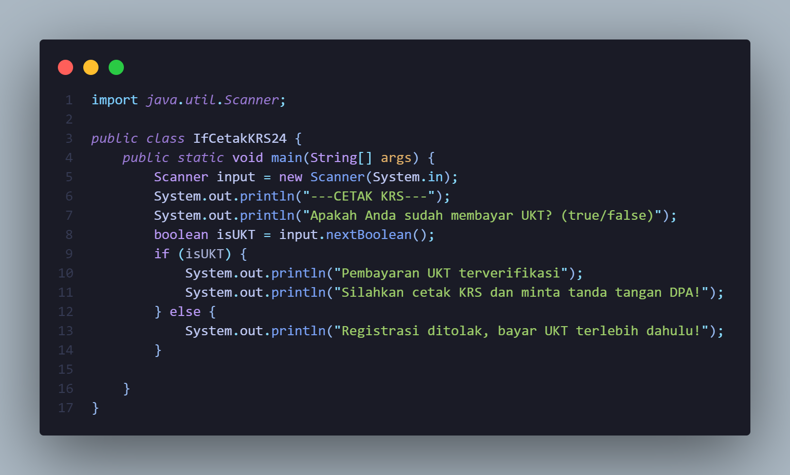
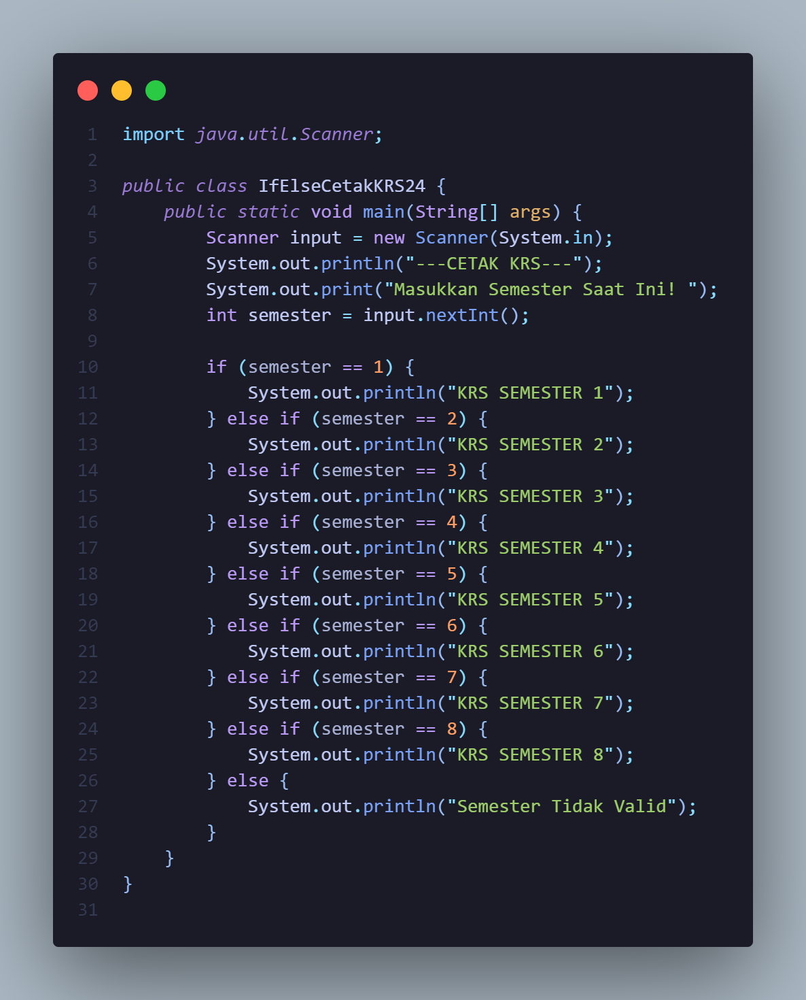

# LAPORAN PRAKTIKUM DASPRO
# JOBSHEET 5 PEMILIHAN
## RAFAEL DIMAS CAHYO L. TI-1C

## PRAKTIKUM 
### 2.1 Percobaan 1
* 1. Mengapa pengecekan pada struktur IF tersebut tidak melibatkan kondisi dengan operator relasional?
* 2. Saat program dijalankan, kemudian Anda mengisikan nilai false, bagaimana hasilnya?
* 3. Sistem perlu memberikan informasi apabila pengguna memasukkan nilai false, maka terdapat keluaran “Registrasi ditolak. Silakan lunasi UKT terlebih dahulu”. Modifikasi program tersebut dengan menambahkan struktur ELSE!
* 4. Commit dan push hasil modifikasi Anda ke Github dengan pesan “Modifikasi Percobaan 1”
### --Jawaban--
* 1. Karena struktur if hanya memeriksa nilai boolean, yaitu true atau false, maka tidak perlu menggunakan operator relasional. Jika nilai boolean bernilai true, maka blok kode di dalam if akan dieksekusi, jika nilai boolean bernilai false, maka blok kode di dalam else akan dieksekusi.
* 2. Program tidak akan menampilkan apa-apa karena belum ditambahi blok kode untuk kondisi else.
* 3. 

### 2.2 Percobaan 2
* 1. Apa fungsi dari sintaks break?
* 2. Apa peran dari sintaks default pada struktur pemilihan SWITCH-CASE?
* 3. Buat file baru dengan nama ifElseCetakKRSNoPresensi.java. File ini berisi program hasil transformasi dari program cetak KRS menggunakan struktur SWITCH-CASE yang telah dibuat ke dalam bentuk IF-ELSE IF-ELSE.
* 4. Commit dan push hasil modifikasi Anda ke Github dengan pesan “Modifikasi Percobaan 2”
### --Jawaban--
* 1. Sintaks break berfungsi untuk menghentikan eksekusi program ketika suatu kondisi terpenuhi. Jika tidak menggunakan break pada akhir case, maka program akan terus mengeksekusi kode di dalam case berikutnya setelah case yang sesuai.
* 2. Sintaks default berfungsi sebagai case lain (else) ketika tidak ada case yang sesuai dengan nilai yang diberikan.
* 3. 

### 2.3 Percobaan 3
* 1. Apa yang terjadi jika mahasiswa menjawab "No" pada pertanyaan bebas kompen? Mengapa demikian?
* 2. Jelaskan maksud dari potongan kode berikut!
* 3. Bagaimana alur pemeriksaan syarat mahasiswa dari awal sampai akhir? Jelaskan secara runtut untuk semua kondisi!
### --Jawaban--
* 1. Jika mahasiswa menjawab No pada pertanyaan bebas kompen, maka program akan tetap menanyakan tentang jumlah log bimbingan dan kemudian akan menampilkan output "Mahasiswa masih memiliki tanggungan kompen". Mengapa demikian? karena program berjalan runtut dari atas kebawah jadi akan tetap menanyakan log bimbingan, lalu program akan memeriksa apakah jawaban bebas kompen sama dengan Ya atau Tidak, jika mahasiswa menjawab Ya maka program akan menjalankan kondisi if dan jika mahasiswa menjawab Tidak maka program akan menjalankan kondisi else.
* 2. Maksud daripada potongan program berikut adalah jika nilai dari variabel bimbinganP1 lebih dari sama dengan 8 dan bimbinganP2 lebih dari sama dengan 4, maka kode program yang ada didalam kondisi if akan dijalankan. Kondisi diatas akan terpenuhi jika kedua kondisi tersebut terpenuhi. Jika ada salah satu kondisi tidak terpenuhi, maka program tidak akan menjalankan kode program di dalam kondisi if. Jika kondisi pertama yaitu bimbinganP1 >= 8 tidak terpenuhi, maka kondisi kedua bimbinganP2 >= 4 tidak akan diperiksa.
* 3. Alur pemeriksaan syarat mahasiswa dari awal sampai akhir adalah sebagai berikut:
* Program memeriksa apakah mahasiswa sudah bebas kompen atau tidak.
* Jika mahasiswa sudah bebas kompen, maka program akan memeriksa apakah jumlah log bimbingan dari pembimbing 1 dan pembimbing 2 sudah mencapai syarat yang ditentukan.
* Jika kedua syarat terpenuhi, maka program akan menampilkan output "Mahasiswa boleh mendaftar ujian skripsi".
* Jika log bimbingan pembimbing 1 kurang dari 8 kali dan log bimbingan pembimbing 2 kurang dari 4 kali, maka program akan menampilkan output "Gagal! Log bimbingan 1 kurang dari 8 kali dan bimbingan 2 kurang dari 4 kali".
* Jika log bimbingan pembimbing 1 kurang dari 8 kali sedangkan log bimbingan pembimbing 2 mencapai syarat, maka program akan menampilkan output "Gagal! Log bimbingan 1 kurang dari 8 kali".
* Jika log bimbingan pembimbing 2 kurang dari 4 kali sedangkan log bimbingan pembimbing 1 mencapai syarat, maka program akan menampilkan output "Gagal! Log bimbingan 2 kurang dari 4 kali".
* Jika mahasiswa belum bebas kompen, maka program akan menampilkan output "Mahasiswa masih memiliki tanggungan kompen".

