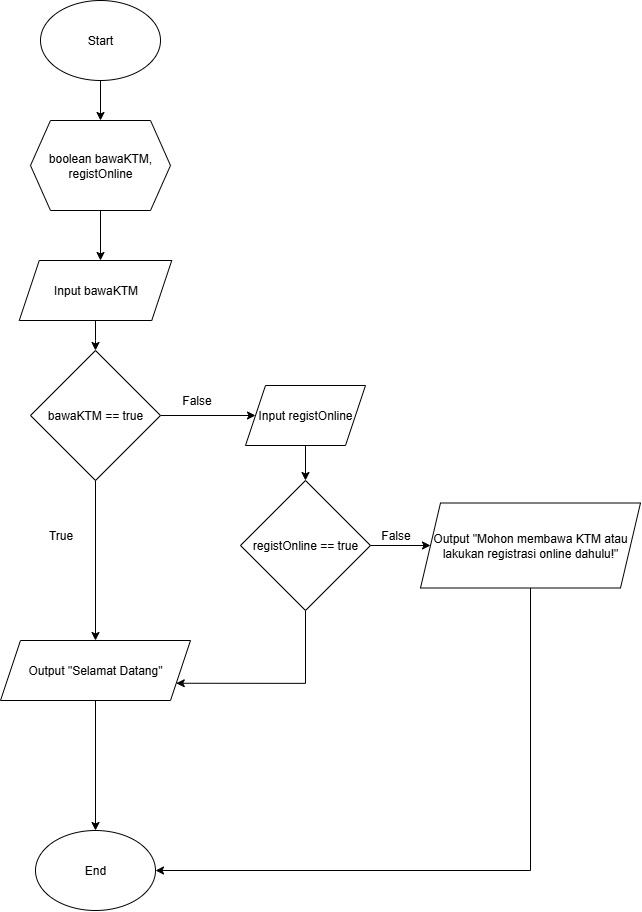
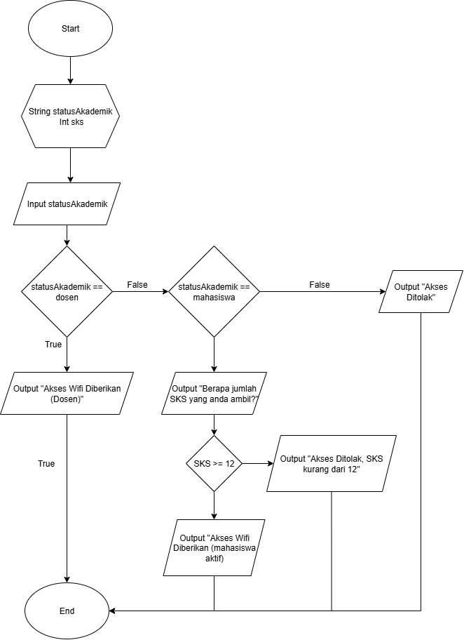

# LATIHAN DASPRO
## RAFAEL DIMAS CAHYO L. TI-1C

### 1. Sistem perpustakaan kampus memberikan izin masuk dengan dua syarat:
* Jika mahasiswa membawa kartu mahasiswa, atau sudah melakukan registrasi
online, maka boleh masuk.
* Jika tidak memenuhi salah satu dari dua syarat tersebut, maka ditolak masuk.
### Buatlah flowchart dan pseudocode untuk menyelesaikan masalah tersebut!

### 2. Di kampus tersedia layanan WiFi gratis yang hanya bisa diakses oleh civitas akademika. Sistem hotspot kampus akan melakukan pengecekan sebagai berikut:
* Jika jenis pengguna adalah dosen, maka tampilkan “Akses WiFi diberikan (dosen)”. 
* Jika jenis pengguna adalah mahasiswa, maka sistem akan memeriksa jumlah SKS yang diambil:
    * Jika SKS ≥ 12, maka tampilkan “Akses WiFi diberikan (mahasiswa aktif)”. 
    * Jika SKS < 12, maka tampilkan “Akses ditolak, SKS kurang dari 12”.
* Jika bukan mahasiswa maupun dosen, maka tampilkan “Akses ditolak”.
### Buatlah flowchart dan pseudocode untuk menyelesaikan masalah tersebut!

