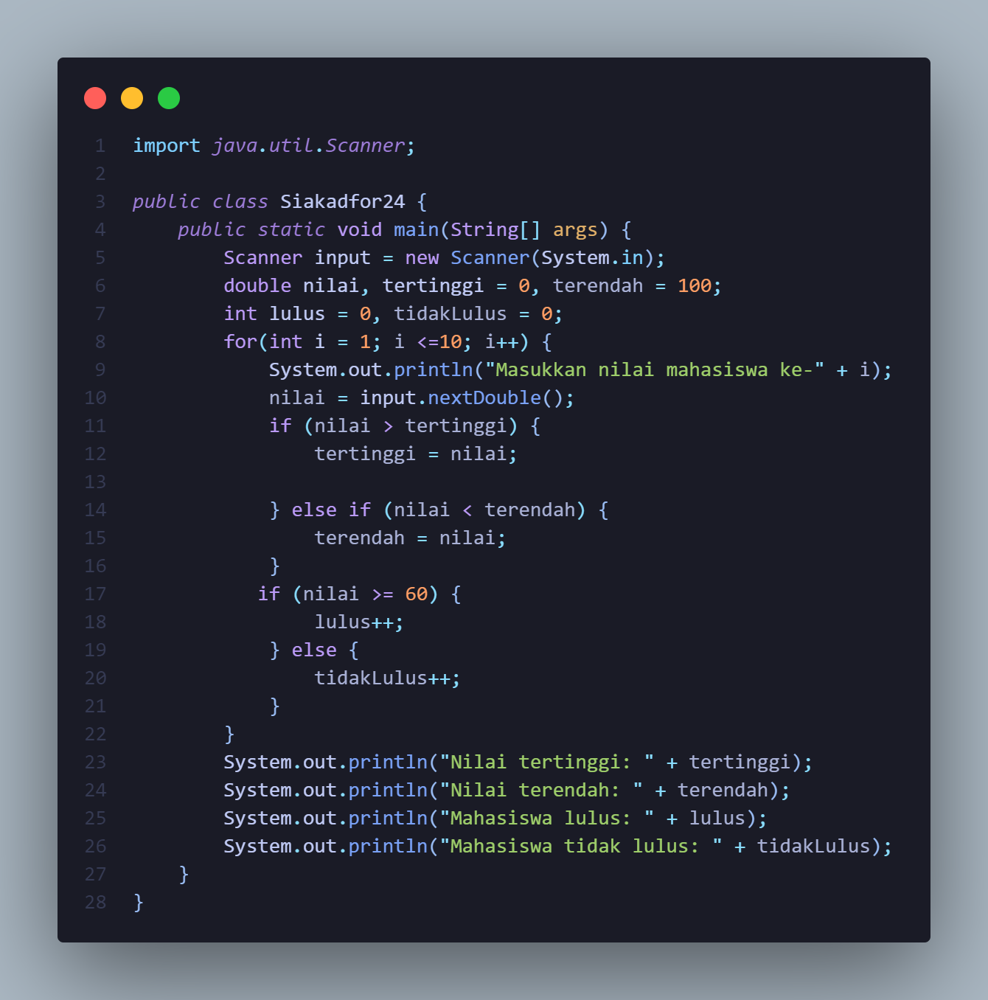
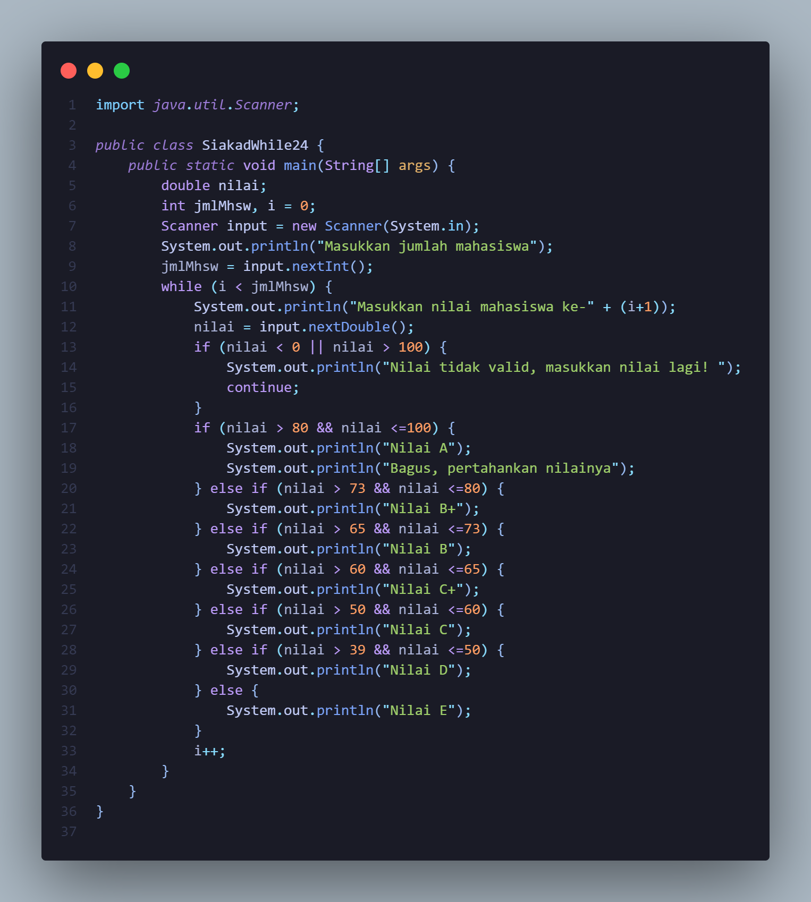
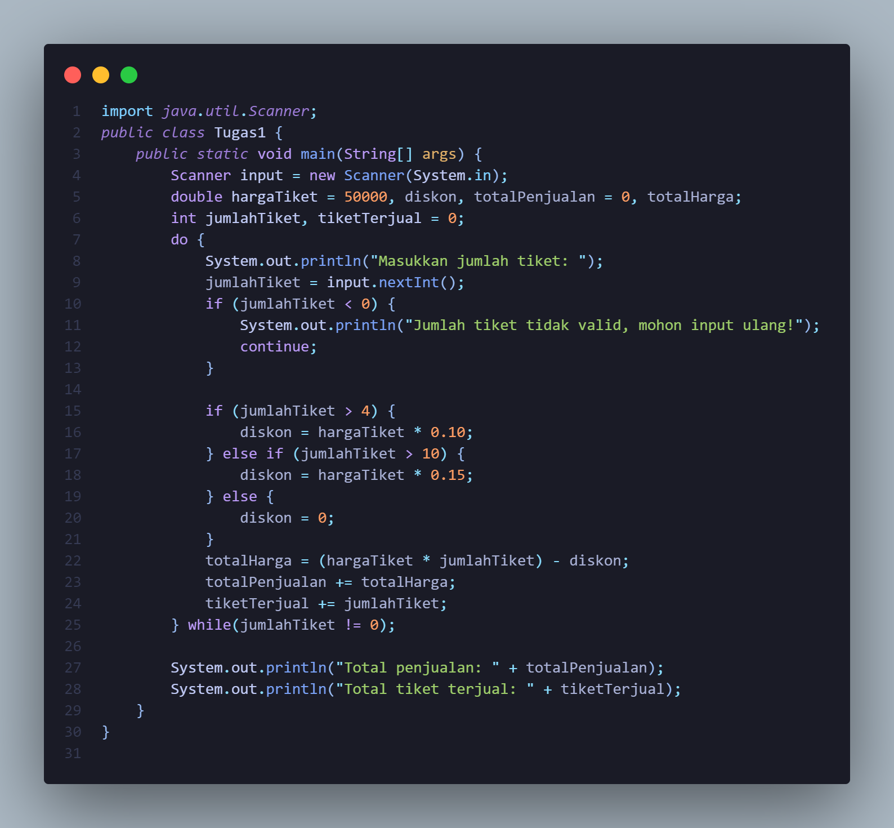
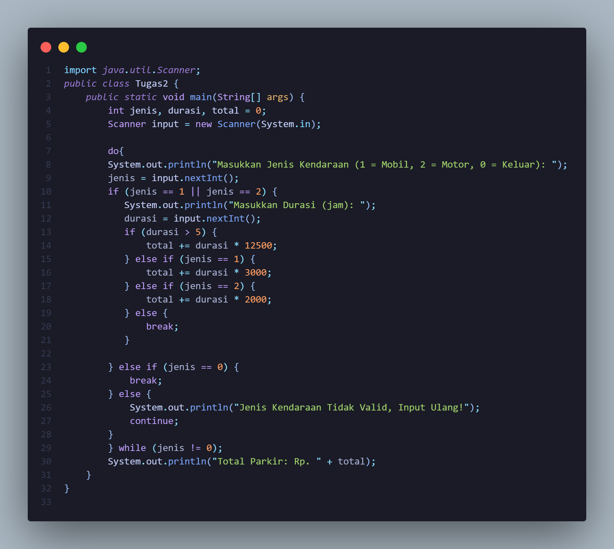

# LAPORAN PRAKTIKUM DASPRO
# JOBSHEET 6 PERULANGAN
## RAFAEL DIMAS CAHYO L. TI-1C

## PRAKTIKUM
### 2.1 Percobaan 1
* 1. Sebutkan dan tunjukkan masing-masing komponen perulangan FOR pada kode program Percobaan 1!
* 2. Mengapa variabel tertinggi diinisialisasi 0 dan terendah diinisialisasi 100? Apa yang terjadi jika variabel tertinggi diinisialisasi 100 dan terendah diinisialisasi 0?
* 3. Jelaskan fungsi dan alur kerja dari potongan kode berikut!
* 4. Modifikasi kode program sehingga terdapat perhitungan untuk menentukan berapa mahasiswa yang lulus dan yang tidak lulus berdasarkan batas kelulusan (nilai minimal 60). Tampilkan jumlah mahasiswa lulus dan tidak lulus setelah menampilkan nilai tertinggi dan terendah!
* 5. Commit dan push kode program ke Github
### Jawaban
* 1. Di dalam perulangan for, ada 3 komponen yaitu inisialisasi, kondisi, dan iterasi. Inisialisasi yaitu nilai awal dari variabel i, kondisi yaitu batas dari perulangan, dan iterasi yaitu penambahan nilai dari variabel i. Selanjutnya, didalam perulangan for, kita menginput nilai mahasiswa dan memeriksa nilai tertinggi dan terendah dari semua mahasiswa.
* 2. Karena jika kita ingin mencari nilai terbesar maka kita mulai dari angka yang paling kecil, jika ada nilai yang lebih tinggi dari angka terkecil itu otomatis akan menggantikannya. Begitu pula dengan nilai terendah, Bila ingin mencari nilai terendah maka kita mulai dari angka yang paling besar, jika ada nilai yang lebih rendah dari angka terbesar itu otomatis akan menggantikannya. Jika variabel tertinggi = 100 dan terendah = 0 maka nilai tertinggi akan selalu 100 dan nilai terendah akan selalu 0 karena tidak ada nilai yang sesuai dengan kondisi.
* 3. Potongan kode berikut berfungsi untuk menentukan nilai tertinggi dan nilai terendah dari semua mahasiswa. Jika nilai > tertinggi yang dimana inisialisasi awal tertinggi = 0, maka nilai yang memenuhi kondisi tersebut akan menggantikan 0 sebagai nilai tertinggi, begitupun seterusnya. Jika nilai < terendah yang dimana inisialisasi awal terendah = 100, maka nilai yang memenuhi kondisi tersebut akan menggantikan 100 sebagai nilai terendah, begitupun seterusnya.
* 4. 

### 2.2 Percobaan 2 
* 1. Pada potongan kode berikut, tentukan maksud dan kegunaan dari sintaks berikut:
    * a. nilai < 0 || nilai > 100
    * b. continue
* 2. Mengapa sintaks i++ dituliskan di akhir perulangan WHILE? Apa yang terjadi jika posisinya dituliskan di awal perulangan WHILE?
* 3. Apabila jumlah mahasiswa yang dimasukkan adalah 19, berapa kali perulangan WHILE akan berjalan?
* 4. Modifikasi kode program sehingga apabila terdapat mahasiswa yang mendapat nilai A, program menampilkan pesan tambahan "Bagus, pertahankan nilainya"!
* 5. Commit dan push kode program ke Github
### Jawaban
* 1. * a. nilai < 0 || nilai > 100 : Berfungsi sebagai kondisi yang akan menjadi syarat untuk memeriksa apakah nilai yang dimasukkan kurang dari 0 atau lebih dari 100, jika memenuhi syarat tersebut maka program akan menampilkan pesan "Nilai tidak valid".
    * b. continue : Berfungsi untuk melanjutkan perulangan tanpa mengeksekusi kode yang ada di bawahnya.
* 2. Sintaks i++ dituliskan di akhir perulangan WHILE karena nilai i kita gunakan dulu diawal baru akan ditambahkan diakhir. Jika kita menuliskan i++ di awal WHILE maka nilai i akan ditambahkan dlu sebelum kita gunakan.
* 3. Jika jumlah mahasiswa yang dimasukkan adalah 19, maka perulangan WHILE akan berjalan sebanyak 19 kali.
* 4. 

### 2.3 Percobaan 3
* 1. Pada penggunaan DO-WHILE ini, apabila nama pelanggan yang dimasukkan pertama kali
adalah “batal”, maka berapa kali perulangan dilakukan?
* 2. Sebutkan kondisi berhenti yang digunakan pada perulangan DO-WHILE tersebut!
* 3. Apa fungsi dari penggunaan nilai true pada kondisi DO-WHILE?
* 4. Mengapa perulangan DO-WHILE tersebut tetap berjalan meskipun tidak ada komponen inisialisasi dan update?
### Jawaban
* 1. Jika nama pelanggan yang dimasukkan pertama kali adalah "batal", maka perulangan akan dilakukan sebanyak 1 kali. Dia akan melakukan kode program yang ada di dalam do terlebih dahulu lalu baru akan memeriksa kondisi while.
* 2. Kondisi berhenti yang digunakan pada perulangan DO-WHILE tersebut adalah jika user menginput batal pada nama pelanggan. Jika user menginput batal maka perulangan akan berhenti.
* 3. Penggunaan nilai true pada kondisi Do-While berfungsi untuk membuat perulangan terus menerus (infinite loop) sampai ada kondisi / perintah berhenti (break).
* 4. Karena dalam perulangan Do-While tersebut menggunakan kondisi true dimana perulangan tidak memiliki batas berhenti sampai ada perintah break dari user, maka dari itu tidak membutuhkan komponen inisialisasi dan update.

### TUGAS
1. 
2. 

